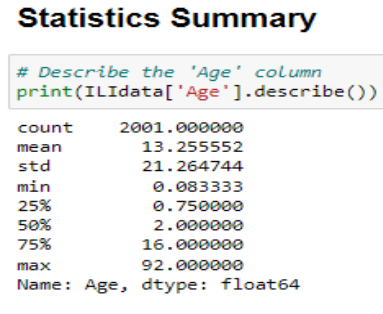
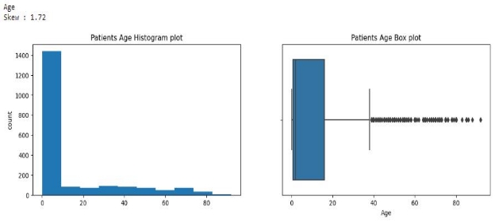
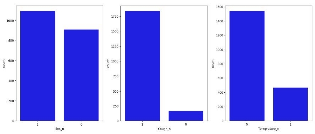
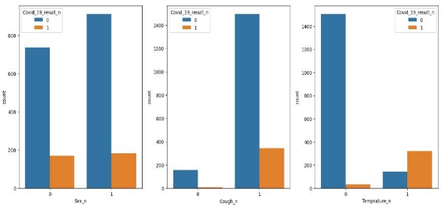
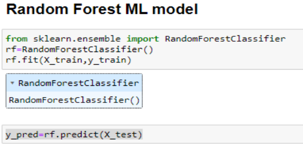
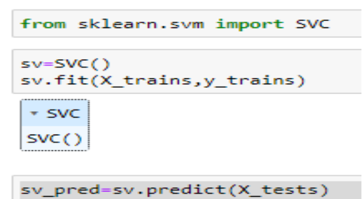
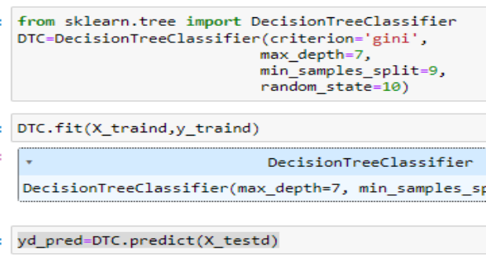
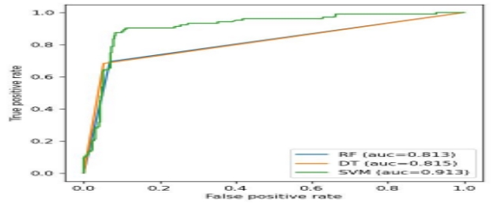



**Department of Data Science 
Business Intelligence Group Project** 

Machine learning model for Early Detection of COVID-19 in influenza like illness (ILI) Patients 

**Submitted to:** Dr. Genet S.** 

**Prepared by:** 1) Abinet Seife 

2) Abrham Keraleme 
2) Chaluma Kumela  
2) Telku Lemessa 

Addis Ababa November 2024 

Table of Contents ![ref1]

1  [**Introduction ........................................................................................................................... 1**](#_page2_x69.00_y79.00)
1. [Background ...................................................................................................................... 1](#_page2_x69.00_y115.00)
1. [Research Question ............................................................................................................ 1](#_page2_x69.00_y351.00)
1. [Objective .......................................................................................................................... 1](#_page2_x69.00_y455.00)
1. [Expected Outcomes .......................................................................................................... 1](#_page2_x69.00_y580.00)
1. [Statement of the Problem ................................................................................................. 2](#_page3_x69.00_y289.00)
2  [**Data Description.................................................................................................................... 3**](#_page4_x69.00_y79.00)
1. [Data Source................................................................................................................... 3](#_page4_x69.00_y111.00)
2. [Dataset Details .............................................................................................................. 3](#_page4_x69.00_y196.00)
2. [Data Transformation and Cleaning............................................................................... 4](#_page5_x69.00_y470.00)
3  [**Methodology .......................................................................................................................... 6**](#_page7_x83.00_y79.00)
3  [**Result and Discussion ........................................................................................................... 9**](#_page10_x69.00_y79.00)
3  [**Results and Discussion ........................................................................................................ 13**](#_page14_x69.00_y79.00)
3  [**Conclusion ........................................................................................................................... 14**](#_page15_x69.00_y79.00)
3  [**Link Phyton script to power BI ......................................................................................... 14**](#_page15_x69.00_y206.00)
3  [**Dashboard ............................................................................................................................ 16** ](#_page17_x69.00_y294.00)[References .................................................................................................................................... 17**](#_page18_x69.00_y79.00)

i 

**1  Introduction ![ref1]**

1. **Background** 

The COVID-19 pandemic, caused by the SARS-CoV-2 virus, emerged in late 2019 and rapidly spread  globally,  overwhelming  healthcare  systems  and  disrupting  economies  worldwide. Characterized by a diverse range of symptoms, including fever, cough, fatigue, and respiratory difficulties, COVID-19 has presented significant challenges in accurate and timely diagnosis. 

Early in the pandemic, the overlapping symptoms of COVID-19 with other respiratory illnesses, such as influenza and common cold, made differential diagnosis difficult. This ambiguity led to delayed diagnosis, inappropriate treatment, and inefficient resource allocation. To address these challenges, researchers and healthcare providers turned to advanced data analytics and machine learning techniques to develop tools for early and accurate COVID-19 detection. 

2. **Research Question** 

How can the application of big data and machine learning (ML) techniques be utilized to accurately predict COVID-19 cases in patients presenting with influenza-like symptoms, thereby enhancing healthcare delivery and patient outcomes? 

3. **Objective** 

The primary objective of this research is to develop a robust machine learning model capable of effectively differentiating between COVID-19 and influenza-like illness (ILI) cases based on a comprehensive analysis of patient data. This model will aid in early and accurate diagnosis, facilitating timely and appropriate medical interventions. 

4. **Expected Outcomes** 
- Improved Diagnostic Accuracy: The development of a high-performance ML model will enhance  the  accuracy  of  COVID-19  diagnosis,  reducing  misdiagnosis  and  delayed treatment. 
- Enhanced Clinical Decision-Making: By providing reliable predictions, the model will ![ref1]empower  healthcare  professionals  to  make  informed  decisions  regarding  patient management and resource allocation. 
- Optimized Public Health Strategies: Accurate and timely identification of COVID-19 cases will enable public health authorities to implement effective control measures, such as contact tracing, isolation, and quarantine. 
- Advanced Knowledge Discovery: The analysis of large-scale medical datasets will uncover valuable insights into the disease's progression, risk factors, and potential therapeutic targets. 
5. **Statement of the Problem** 

Influenza-Like Illness (ILI) and COVID-19 share a significant number of overlapping symptoms, making early differentiation between the two a complex challenge. This diagnostic ambiguity can lead to: 

- Delayed and Misdiagnosis: Incorrect identification of either illness can result in delayed or inappropriate treatment, potentially exacerbating patient outcomes. 
- Inefficient Resource Allocation: Misdiagnosis can lead to the misallocation of healthcare resources, such as testing kits, hospital beds, and medical personnel. 
- Suboptimal Public Health Response: Incorrect classification of cases can hinder effective public health strategies, including contact tracing, isolation, and quarantine measures. 

To address these challenges, this research aims to develop a machine learning model capable of accurately differentiating between ILI and COVID-19 cases based on patient symptoms and other relevant clinical data.  

**2  Data Description ![ref1]**

1. **Data Source** 

The dataset utilized in this study was collected by the Ethiopian Public Health Institute (EPHI) in 2023 from a diverse range of healthcare facilities across Ethiopia. 

2. **Dataset Details** 

**Sample Size** 

The  dataset  comprises  2,001  individuals  who  presented  with  Influenza-Like  Illness  (ILI) symptoms. 

**Features** 

The dataset includes the following features: 

- **Independent Variables:**  
- Demographic information (age, sex, etc.) 
- Clinical symptoms (fever, cough, shortness of breath, etc.) 
- Medical history (chronic conditions, etc.) 
- Laboratory test results (e.g., white blood cell count, C-reactive protein) 
- **Dependent Variable:**  
- PCR test result (positive or negative for SARS-CoV-2) 

**Variable Description ![ref1]**

The following table provides a detailed description of the variables used in this project, including their value labels. 

**Table 1:** Variable description including their value labels 

<table><tr><th colspan="1" valign="top"><b>Variable Category</b></th><th colspan="1" valign="top"><b>Variable Name</b></th><th colspan="1" valign="top"><b>Value</b></th><th colspan="1" valign="top"><b>Label</b></th><th colspan="1" valign="top"><b>Variable Category</b></th><th colspan="1" valign="top"><b>Variable Name</b></th><th colspan="1" valign="top"><b>Value</b></th><th colspan="1" valign="top"><b>Label</b></th></tr>
<tr><td colspan="1" rowspan="2" valign="top"><b>Target</b></td><td colspan="1" rowspan="2" valign="top">COVID-19 Case</td><td colspan="1" valign="top">0</td><td colspan="1" valign="top">Negative</td><td colspan="1" rowspan="2" valign="top"><b>Features</b></td><td colspan="1" rowspan="2" valign="top">runny nose</td><td colspan="1" valign="top">0</td><td colspan="1" valign="top">No</td></tr>
<tr><td colspan="1" valign="top">1</td><td colspan="1" valign="top">Positive</td><td colspan="1" valign="top">1</td><td colspan="1" valign="top">Yes</td></tr>
<tr><td colspan="1" rowspan="11" valign="top"><b>Features</b></td><td colspan="1" valign="top">Age</td><td colspan="2"></td><td colspan="1" rowspan="11" valign="top">Sore-throat</td><td colspan="1" valign="top">0</td><td colspan="1" valign="top">No</td></tr>
<tr><td colspan="1" rowspan="2" valign="top">Gender</td><td colspan="1" valign="top">0</td><td colspan="1" valign="top">Female</td><td colspan="1" valign="top">1</td><td colspan="1" valign="top">Yes</td></tr>
<tr><td colspan="1" valign="top">1</td><td colspan="1" valign="top">Male</td><td colspan="1" rowspan="2" valign="top">Hemoptysis</td><td colspan="1" valign="top">0</td><td colspan="1" valign="top">No</td></tr>
<tr><td colspan="1" rowspan="2" valign="top">Cough</td><td colspan="1" valign="top">0</td><td colspan="1" valign="top">No</td><td colspan="1" valign="top">1</td><td colspan="1" valign="top">Yes</td></tr>
<tr><td colspan="1" valign="top">1</td><td colspan="1" valign="top">Yes</td><td colspan="1" rowspan="2" valign="top">Breathing</td><td colspan="1" valign="top">0</td><td colspan="1" valign="top">No</td></tr>
<tr><td colspan="1" rowspan="2" valign="top">Temperature</td><td colspan="1" valign="top">0</td><td colspan="1" valign="top">No</td><td colspan="1" valign="top">1</td><td colspan="1" valign="top">Yes</td></tr>
<tr><td colspan="1" valign="top">1</td><td colspan="1" valign="top">Yes</td><td colspan="1" rowspan="2" valign="top">Arthritis</td><td colspan="1" valign="top">0</td><td colspan="1" valign="top">No</td></tr>
<tr><td colspan="1" rowspan="2" valign="top">Headache</td><td colspan="1" valign="top">0</td><td colspan="1" valign="top">No</td><td colspan="1" valign="top">1</td><td colspan="1" valign="top">Yes</td></tr>
<tr><td colspan="1" valign="top">1</td><td colspan="1" valign="top">Yes</td><td colspan="1" rowspan="2" valign="top">Vomiting </td><td colspan="1" valign="top">0</td><td colspan="1" valign="top">No</td></tr>
<tr><td colspan="1" rowspan="2" valign="top">Skin rash</td><td colspan="1" valign="top">0</td><td colspan="1" valign="top">No</td><td colspan="1" valign="top">1</td><td colspan="1" valign="top">Yes</td></tr>
<tr><td colspan="1" valign="top">1</td><td colspan="1" valign="top">Yes</td><td colspan="1"></td><td colspan="1"></td><td colspan="1"></td></tr>
</table>
3. **Data Transformation and Cleaning** 

**Data Transformation** 

To prepare the data for machine learning models, categorical features were transformed into numerical representations. This process, known as label encoding, assigns a unique numerical code to each category. 

**Data Cleaning** 

To ensure data quality and model accuracy, several data cleaning steps were performed: 

**Missing Value Handling:  ![ref1]**

- Instances with missing target labels were removed from the dataset. 
- Features with a high proportion of missing values (greater than 75%) were eliminated to avoid introducing bias and reducing the model's performance. 
- For  features  with  a  lower  percentage  of  missing  values,  imputation  techniques  were employed to fill in the gaps. In this case, the average of the other field values was used to impute the missing values. This approach is suitable when the missing values are missing at random and the feature distribution is approximately normal. 

By addressing missing values and transforming categorical features, the dataset was prepared for subsequent modeling steps. 

**Feature scaling** 

Feature scaling is a preprocessing technique in machine learning where numerical data features are transformed to fall within a specific range or distribution. This step is essential to model performance and stability, particularly for algorithms sensitive to the scale of input data. 

**Data Splitting** 

To evaluate the performance of the machine learning models, the dataset was divided into two subsets: a training set and a testing set. A common approach is to use a 75-25 split, where 75% of the data is allocated to the training set and the remaining 25% to the testing set. 

The  training  set  is  used  to  train  the  models,  while  the  testing  set  is  used  to  evaluate  their performance on unseen data. This split helps to assess the model's ability to generalize to new, unseen data, providing a reliable estimate of its real-world performance.    

**3  Methodology ![ref1]**

1. **Model Selection** 

**Criteria for Model Selection:** the selection of machine learning models for this study was guided by several key considerations: 

1. **Problem Type:** The task of differentiating between COVID-19 and ILI cases is a binary classification problem, requiring a model capable of assigning instances to one of two classes (positive or negative for COVID-19). 
1. **Data Characteristics:**  
- Size: The dataset, though informative, is relatively small, limiting the complexity of models that can be effectively trained. 
- Feature Types: The dataset comprises a mix of categorical and numerical features, necessitating models that can handle diverse data types. 
3. **Desired Model Properties:**  
- Accuracy: The model must exhibit high accuracy to minimize misclassifications, ensuring reliable predictions. 
- Interpretability: The model's decision-making process should be understandable to domain experts, facilitating trust and transparency. 
- Computational  Efficiency:  The  model  should  have  reasonable  computational requirements, considering potential resource constraints. 

**Selected Models ![ref1]**

Based on the aforementioned criteria, the following machine learning models were selected for this study: 

1. **Random Forest (RF):**  
- Ensemble learning technique that combines multiple decision trees. 
- Handles both categorical and numerical data effectively. 
- Robust to overfitting and capable of handling missing values. 
- Provides feature importance measures for interpretability. 
2. **Decision Tree (DT):**  
- Simple and interpretable model that makes decisions based on a series of rules. 
- Can handle both categorical and numerical data. 
- Prone to overfitting, especially with small datasets. 
3. **Support Vector Machine (SVM):**  
- Powerful classification algorithm that finds the optimal hyperplane to separate data points. 
- Effective for high-dimensional datasets. 
- Can be computationally expensive for large datasets. 

These models were selected as they offer a balance of accuracy, interpretability, and computational efficiency, making them suitable for the given task and dataset characteristics. 

2. **Model Evaluation Metrics** 

To assess the performance of the selected machine learning models, a comprehensive set of evaluation metrics will be employed. These metrics are essential for understanding the accuracy, reliability, and overall effectiveness of the models in predicting COVID-19 cases. 

**General Evaluation Metrics ![ref1]**

- Accuracy: This metric measures the proportion of correct predictions made by the model. It is calculated as the ratio of correctly classified instances to the total number of instances. 
- Precision:  Precision  quantifies  the  proportion  of  true  positive  predictions  among  all positive predictions. It helps assess the model's ability to correctly identify positive cases.    
- Recall:  Recall  measures  the  proportion  of  true  positive  predictions  among  all  actual positive instances. It evaluates the model's ability to identify all positive cases. 
- F1-Score: The F1-score is the harmonic mean of precision and recall, providing a balanced measure of both metrics. It is particularly useful when there is a class imbalance.    

**Evaluation Metrics for Imbalanced Data** 

- Area Under the Receiver Operating Characteristic Curve (AUC-ROC): This metric is well- suited for imbalanced datasets. It evaluates the model's ability to distinguish between positive and negative classes across various classification thresholds. A higher AUC-ROC score indicates better model performance. 

By employing these evaluation metrics, a thorough assessment of the models' performance was conducted, enabling the identification of the most suitable model for the task of COVID-19 prediction. 

8 
9  **Result and Discussion  ![ref1]**

**4.1 Exploratory Data Analysis** 

**Summary Statistics** 

The statistical summary provides key insights into the distribution of the "Age" variable for a dataset containing 2,001 observations. 

- There are 2,001 entries in the "Age" column, indicating no missing values in this dataset. 
- Mean (Average Age): The mean age is approximately 13.26 years, suggesting that the average patient in this dataset is relatively young. 
- Standard Deviation (std): The standard deviation is 21.26, which indicates a significant spread in the age values. This large variation reflects a diverse age range among patients. 
- Minimum  and  Maximum  Values:  The  age  ranges  from  a  minimum  of  0.08  years (approximately 1 month) to a maximum of 92 years. This wide age range suggests the dataset includes both infants and elderly individuals. 

9 

The graphical results include a histogram and a box plot representing the age distribution of ![ref1]patients in the dataset. These visualizations provide insights into the central tendency, spread, skewness, and outliers present in the age data. 

**Fig. 1**: Histogram and Box-and-Whisker Plot for the Continuous Variable Age **Categorical Feature Distributions**   

The three bar charts presented below and stacked bar charts show the distributions of categorical variables:  

**Fig 2:** Stacked bar charts showing the distribution of categorical variables (Sex, Cough, and Temperature). 

11 

**Fig. 3:** Stacked bar charts showing the distribution of categorical variables (Sex, Cough, and ![ref1]Temperature) in relation to COVID-19 test results. 

**Model Building**  

In this study, we utilized three machine learning models—Random Forest (RF), Decision Tree (DT), and Support Vector Machine (SVM)—to classify COVID-19 test results based on patient characteristics. These models were implemented using Python, as detailed in the following code. 

**Fig. 4:** Python Code for Implementing Machine Learning Models ![ref1]

13 
15  **Results and Discussion ![ref1]**

**Model Evaluation Summary** 

The table below summarizes accuracy, precision, recall, F1-score, and AUC for each model. Each model achieved high accuracy, with the SVM model performing best on most metrics. **Table 2:** Model Performance Metrics Summary 

Machine learning Algorism 

Evaluation Metrics 

Random Forest  Decision Tree  SVM 

ROC\_AUC   0.81  0.82  0.91 Accuracy  0.90  0.90  0.70 Precision  0.67  0.72  0.74 Recall  0.71  0.68  0.83 F1 Score  0.69  0.70  0.78 

AUC Score Comparison: 

SVM achieved an AUC of 0.91, outperforming RF and DT and indicating superior discrimination between positive and negative COVID-19 cases. 

**Fig. 5:** ROC-AUC curve for the three models 

15 

**6  Conclusion ![ref1]**

The SVM model emerged as the most effective model for predicting COVID-19 cases within the ILI dataset. Its high accuracy and AUC make it a strong candidate for deployment in real-world settings,  potentially  improving  COVID-19  diagnosis  among  ILI  patients  and  enabling  better resource allocation. 

**7  Link Phyton script to power BI** 

Start-Process " C:\Program Files\WindowsApps\Microsoft.MicrosoftPowerBIDesktop\_2.137.1102.0\_x64\_\_8wekyb3d8bbwe \bin" 

import pandas as pd  

from pycaret.classification import \* 

model = load\_model(r"C:\Users\teklu\Desktop\ C:\Users\teklu\Desktop\GP3project\ilidata\_rf") prediction\_df  = predict\_model(model, data=dataset) 

- Get the feature importances 

importances = rf.feature\_importances\_ 

- Assuming rf.feature\_names is your list of feature names 

features = Feature 

- Create a DataFrame with features and their corresponding importances 

importance\_df = pd.DataFrame(zip(features, importances), columns=['Features', 'Importances']) 

- Display the DataFrame 

print(importance\_df) 

- prediction  

Feature=['Sex\_n', 'Cough\_n', 'Temprature\_n', 'Headache\_n', 'Skin\_rash\_n', 'runny\_nose\_n', 'sorthroat\_n', 'Hemoptysis\_n', 'Breathing\_n', 'Arthritis\_n', 'Vomiting\_n'] 

16 

ili\_data\_encoded = pd.get\_dummies(ili\_data, drop\_first=True) ![ref1]plt.figure(figsize=(12, 8)) 

sns.heatmap(ili\_data\_encoded.corr(), annot=True, cmap='coolwarm', linewidths=0.4) plt.title("Correlation Matrix (Encoded)") 

plt.show() 

- 'dataset' holds the input data for this script 

import pandas as pd  

from pycaret.classification import load\_model, predict\_model 

- Load the model 

model = load\_model(r"C:/Users/Teklu/Desktop/GP3project/rf\_model") #model = load\_model(r"rf\_model") 

- Make predictions on the dataset 

prediction\_df = predict\_model(model, data=dataset) 

- Get the feature importances from the model importances = model.feature\_importances\_ 
- Assuming model.feature\_names is your list of feature names features = model.feature\_names\_in\_ 
- Create a DataFrame with features and their corresponding importances 

  importance\_df = pd.DataFrame(zip(features, importances), columns=['Features', 'Importances']) 

- Create the boxplot 

`   `plt.figure(figsize=(10, 6))    sns.boxplot(x=df['Age']) 

`   `plt.title("Boxplot of Age")    plt.xlabel("Age") 

- Show the plot plt.show() 

**8  Dashboard ![ref1]**

This dashboard presents visualizations of key variables and features.

**References ![ref1]**

1. World  Health  Organization  (WHO).  COVID-19  Dashboard. Accessed  February  2023. [https://covid19.who.int/ ](https://www.google.com/url?sa=E&source=gmail&q=https://covid19.who.int/)
1. Centers for Disease Control and Prevention (CDC). COVID-19. Accessed February 2023.  
1. National Institutes of Health (NIH). COVID-19 Research. Accessed February 2023. 
1. Developing and validating clinical features-based machine learning algorithms to predict influenza infection in influenza-like illness patients: 

   [ https://www.ncbi.nlm.nih.gov/pmc/articles/PMC10498408/ ](https://www.ncbi.nlm.nih.gov/pmc/articles/PMC10498408/)

5. A Decision Support System for Diagnosis of COVID-19 from non-COVID-19 Influenza- like Illness Using Explainable Artificial Intelligence:   

   [https://www.mdpi.com/2306-5354/10/4/439 ](https://www.mdpi.com/2306-5354/10/4/439)

6. Full  article: Artificial  intelligence  for  diagnosis  of  mild–moderate  COVID-19  using hematological markers:  

   [ https://www.tandfonline.com/doi/full/10.1080/07853890.2023.2233541 ](https://www.tandfonline.com/doi/full/10.1080/07853890.2023.2233541)
20 

[ref1]: Aspose.Words.cec1bfc9-8894-4fc3-8f0a-d654db9ababb.003.png
